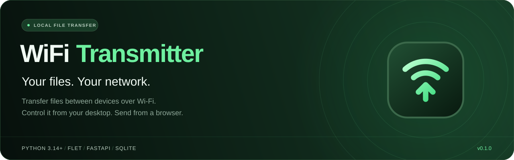
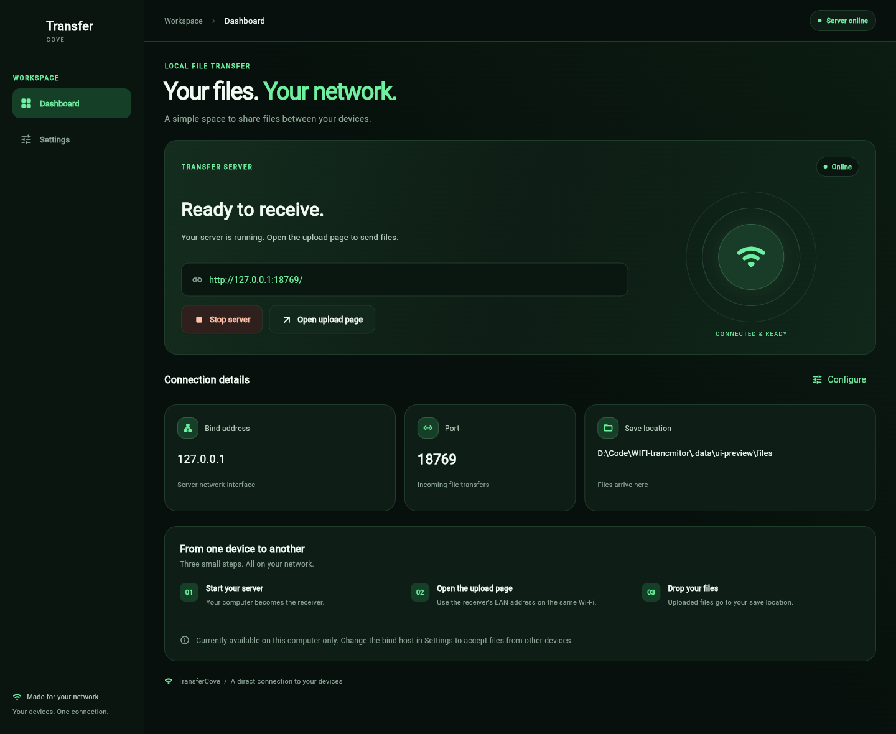
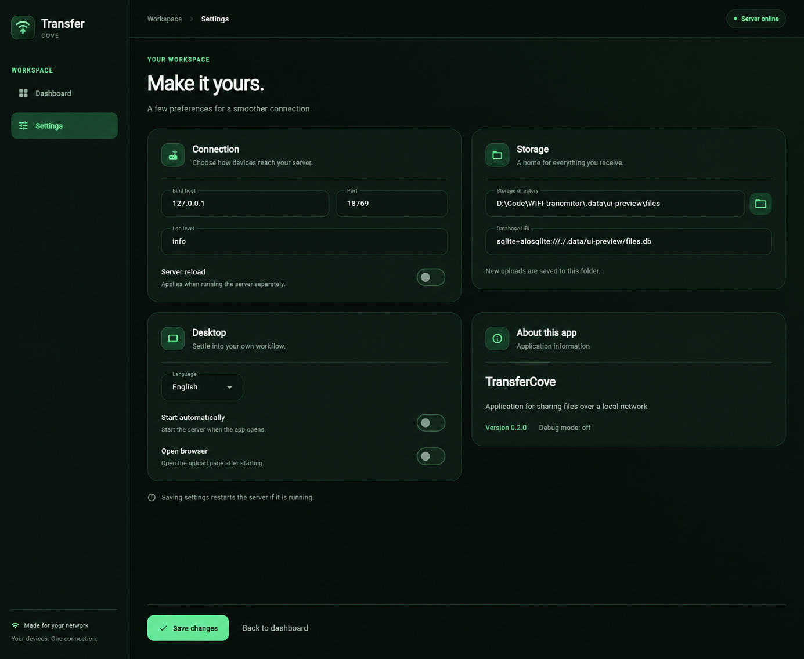
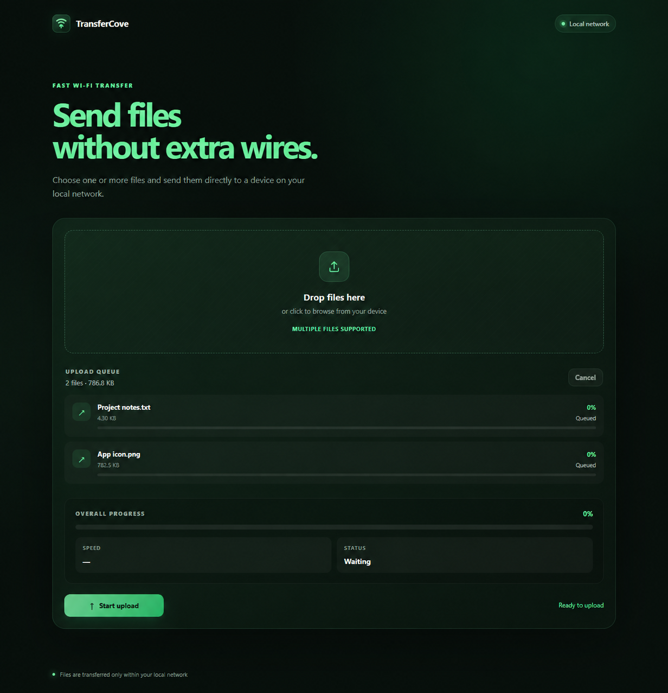
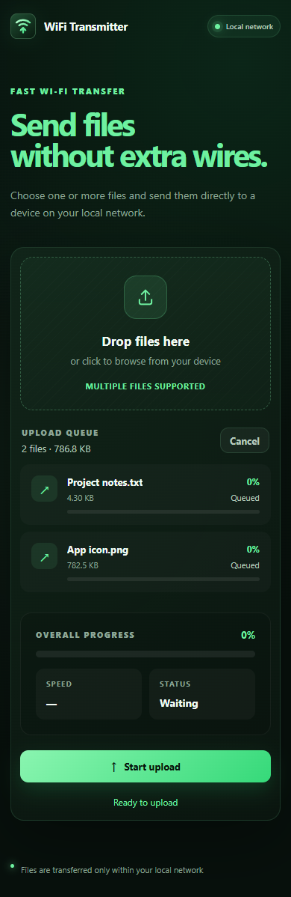

<div align="center">



<br>

**Local file transfers with a desktop control panel and a browser upload page.**

The computer receives files. A phone, tablet, or another computer sends them from a browser.

[Features](#features) · [Preview](#preview) · [Quick start](#quick-start) · [Connect another device](#connection) · [Development](#development)

<br>


</div>

<br>

<a id="features"></a>

## Everything you need for local file transfers

| On the desktop | In the browser | Inside your network |
| :--- | :--- | :--- |
| Start and stop the server with one click | Drag and drop or select multiple files | Upload directly to the receiving computer |
| See server status, address, port, and save location | Track the queue, per-file progress, and total speed | Store files on disk with metadata in SQLite |
| Configure connection, storage, and auto-start behavior | Stop an active upload or cancel the queue | Work without cloud storage |

The dark green interface adapts to the window size. The sending device only needs a browser — there is no app to install on it.

<a id="preview"></a>

## One visual language. Two interfaces.

The desktop app manages the receiver. Any modern browser can act as the sender.

<table>
  <tr>
    <td align="center" width="25%">
      <a href="docs/images/dashboard.png"></a><br>
      <sub><strong>Dashboard</strong><br>Control the receiver</sub>
    </td>
    <td align="center" width="25%">
      <a href="docs/images/settings.png"></a><br>
      <sub><strong>Settings</strong><br>Shape your workflow</sub>
    </td>
    <td align="center" width="25%">
      <a href="docs/images/upload.png"></a><br>
      <sub><strong>Upload page</strong><br>Send from any browser</sub>
    </td>
    <td align="center" width="25%">
      <a href="docs/images/upload-mobile.png"></a><br>
      <sub><strong>Mobile layout</strong><br>Works on smaller screens</sub>
    </td>
  </tr>
</table>

<p align="center"><sub>Click any screenshot to open the full-size image. Screenshots were captured in an isolated demo environment with a sample upload queue.</sub></p>

<a id="quick-start"></a>

## Quick start

You need **Python 3.14+** and **Poetry**. Clone or download the project, then open a terminal in its directory.

```bash
poetry install
poetry run python main.py
```

Open **Dashboard → Start server**, then choose **Open upload page**. By default, the upload page is available on the receiving computer at `http://127.0.0.1:8000/`.

Desktop preferences are stored between launches. When the server is started from the desktop app, database migrations are applied automatically.

<a id="connection"></a>

## Send from another device

1. Connect the devices to the same local network.
2. In **Settings → Connection**, click **Use current LAN address** and save the settings. The detected IPv4 address is inserted automatically.
3. Start the server. The dashboard shows the shareable address and provides **Copy link** and **QR code** actions.
4. On the other device, scan the QR code or open the copied link.
5. Add files and select **Start upload**. They will appear in the folder configured under **Storage**.

`0.0.0.0` is a server bind address, not an address to enter in a browser. `127.0.0.1` is reachable only from the receiving computer itself. If the connection fails, allow incoming connections to the selected port in the firewall for your private network. If the computer changes networks, use **Use current LAN address** again.

### Available settings

| Section | Controls |
| :--- | :--- |
| Connection | Bind host, automatic LAN address detection, port, and reload for a separately launched server |
| Storage | Destination folder for received files |
| Desktop | Language preference, automatic server start, and browser opening behavior |
| About this app | Application title, description, version, and debug state — read-only information |

Saving settings restarts a running server. The server embedded in the desktop app always runs without reload; the reload option applies when the server is launched separately.

<details>
<summary><strong>Environment variables and `.env`</strong></summary>

The `.env` file is optional. If you do not have one yet, copy [`.env.example`](.env.example):

```powershell
# Windows PowerShell
Copy-Item .env.example .env
```

```bash
# macOS / Linux
cp .env.example .env
```

Important defaults:

```dotenv
UVICORN__HOST=127.0.0.1
UVICORN__PORT=8000
TRANSMITTER__STORAGE_DIR=.data/files
TRANSMITTER__DATABASE_URL=sqlite+aiosqlite:///./.data/files.db
DESKTOP__AUTO_START=False
DESKTOP__OPEN_BROWSER=True
```

The desktop app uses `.env` as its initial configuration, then loads saved preferences from its SQLite settings database. On Windows builds, Flet stores application data under `%APPDATA%\TransferCove\data`; the first launch after the storage-path change copies data from the old `Your Company\TransferCove` location without overwriting newer files. When running from source without `FLET_APP_STORAGE_DATA`, the desktop settings database is stored under `.flet-data/data/desktop-settings.db`. The standalone web server reads its configuration from `.env` and environment variables.

`APP__*` variables describe the application and are intentionally not editable through the interface.

</details>

<a id="development"></a>

## Development

### Run the web server without the desktop window

```bash
poetry run alembic upgrade head
poetry run python -m app.server_start_up
```

Once running, these endpoints are available:

| Endpoint | Purpose |
| :--- | :--- |
| `/` | Browser upload page |
| `/health` | Server health check |
| `/docs` | Interactive FastAPI documentation |
| `POST /v1/files` | Upload one file using the multipart `file` field |

Uploaded files are stored under UUID-based names while preserving their original extension. Original names and metadata are kept in the database. The list, download, and delete API endpoints are currently placeholders.

### Run the test suite

The project uses `pytest` for unit and integration tests. The suite covers configuration validation, SQLite migrations, settings persistence, file-storage cleanup, the upload service, and the public FastAPI endpoints.

```bash
poetry run pytest
```

The tests create temporary databases and storage directories, so they do not modify `.data/` or the local settings database.

### Project structure

```text
app/
├── view/          # Flet desktop screens
├── controller/    # UI, settings, and server coordination
├── server/        # Embedded FastAPI server lifecycle
├── static/        # Browser upload page: HTML, CSS, and JavaScript
├── routes/        # HTTP routes
├── services/      # File uploads and settings operations
├── repository/    # Data access
├── models/        # SQLAlchemy models
└── core/          # Configuration, database, and shared theme
assets/            # Shared SVG, PNG, ICO, and favicon assets
alembic/           # Database migrations
docs/images/       # Banner and interface screenshots
tools/             # Brand asset export tools
main.py            # Flet build entry point
```

### Icon assets and Windows builds

The source mark is [`assets/icon.svg`](assets/icon.svg). The same visual identity is used by the desktop app and the browser page. The repository includes a six-size ICO for Windows, a 1024 × 1024 PNG for Flet builds, SVG and favicon files for browsers, and an Apple Touch Icon for home-screen shortcuts.

After changing the SVG, regenerate the raster assets with:

```bash
poetry run python -m pip install playwright
poetry run python -m playwright install chromium
poetry run python tools/export_brand.py
```

Build the Windows desktop package on Windows:

```bash
poetry run flet build windows --yes
```

Flet reads the application icon from `assets/icon.png`; the build entry point, artifact name, and local-data exclusions are configured in `pyproject.toml`. A Windows build also requires Flutter and the C++ desktop tools from Visual Studio. See the [Flet Windows publishing guide](https://flet.dev/docs/publish/windows/) for the platform prerequisites.

### Windows installer and license notices

The repository includes an Inno Setup script at [`installer/windows/TransferCove.iss`](installer/windows/TransferCove.iss). After building the Flet application, open the script with Inno Setup Compiler to create `dist/installer/TransferCove-Setup-0.2.3.exe`:

```text
poetry run flet build windows --yes
iscc installer/windows/TransferCove.iss
```

The installer displays the MIT license, installs [`LICENSE`](LICENSE) and [`THIRD-PARTY-NOTICES.txt`](THIRD-PARTY-NOTICES.txt), and preserves the dependency license metadata shipped in the Flet bundle. The generated installer should be digitally signed before public distribution; signing is intentionally kept outside the repository so certificates and passwords are never committed. If dependency versions change during a rebuild, update `THIRD-PARTY-NOTICES.txt` from the final bundle before publishing the installer.

### Current project boundaries

- File uploads to the receiving computer are implemented. Listing, downloading, and deleting files through the API remain placeholders.
- Full localization is not connected yet: the interface is currently English, while the language selector stores a preference for future localization.
- The server uses plain HTTP without authentication. The application is intended for a trusted local network; public deployment requires separate access control and HTTPS configuration.

<a id="license"></a>

## License

TransferCove is open-source software licensed under the [MIT License](LICENSE).
You may use, modify, and redistribute the project, including in commercial products,
provided that the copyright and license notices are preserved.
This license covers the project code and original assets in this repository; third-party
dependencies remain under their own licenses.

<br>

<div align="center">


**TransferCove**<br>
<sub>Your devices. One connection.</sub>

</div>
